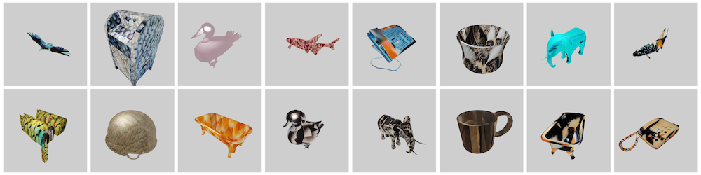

# retexture
using blender to augment 3d model textures



## Installation

1. clone the repo `git clone "https://github.com/mhyatt000/retexture"`
2. `pip install -e .`

### Installing blender

* MacOS: `brew install blender`
* Unix: `apt-get install blender`

### Install Blender via script

see `./install.sh`

## Dataset Setup

place all models in `datasets/models` and place textures in `datasets/textures` like so:

```
datasets
├── models
│   ├── bird1.dae
│   ├── butterfly1.dae
│   ...
├── datasets/textures
│   ├── bird1.jpg
│   ├── butterfly1.png
│   ...
```

## Config Setup

see `configs/base.yaml`

## Run

`python -m retexture run`

## NOTES and Design Choices

### Blender is incompatible with external python libraries

* Blender uses its own distribution of Python
* does not allow changes to site packages (without weird hacks)
    * ie: using `sys.path.append` as a workaround

### Argparse conflicts with blender commandline arguments

Solution: 
* `blender -b -P <script.py> -- <args>`

### GPU rendering seems to cause problems
* Yields a black image 
    * could be due to external servers having limited GUI
    * could be due to problems with the GPU and CUDA compatible libraries
* Blender provides lower level gpu support... see [docs](https://docs.blender.org/api/current/gpu.html)

### Memory required increases with job runtime
* Blender keeps a history of all operations

Solution: 
* Render jobs are split into batches
* Master script spins off Blender processes with the child script

## Known Problems

* Bounding box centering fails occasionally
