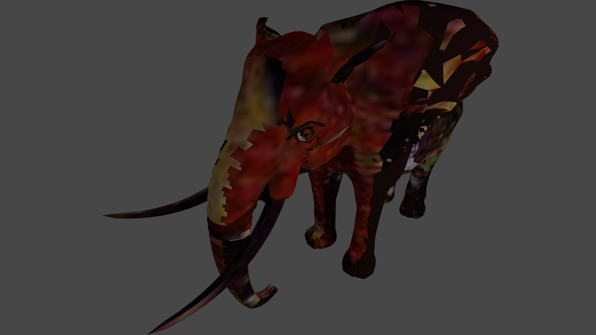
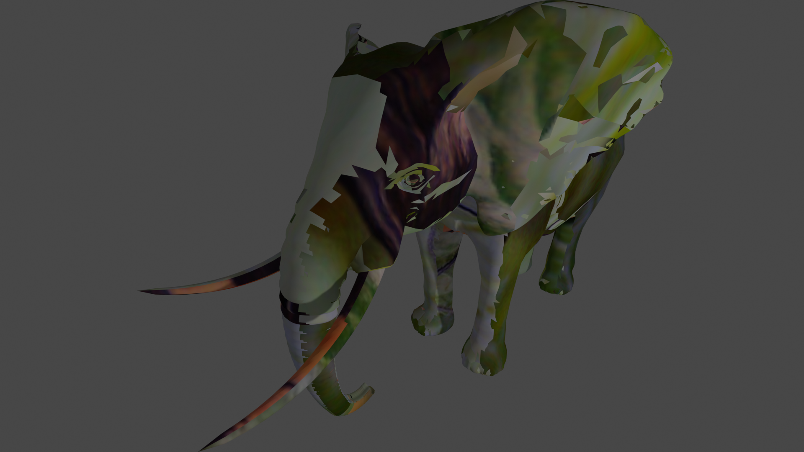
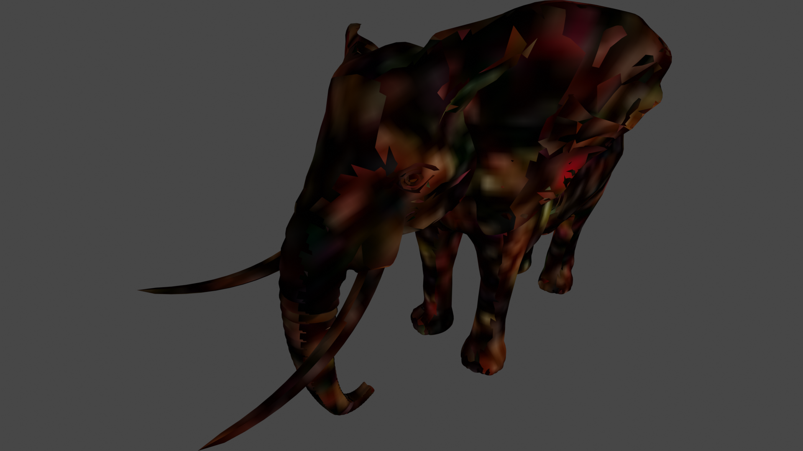
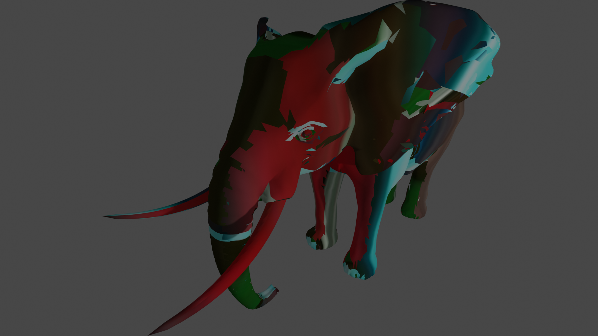

# retexture
using blender to augment 3d model textures

<table>
  <tr>
    <td></td>
    <td></td>
  </tr>
  <tr>
    <td></td>
    <td></td>
  </tr>
</table>

## Installation

1. clone the repo (more instructions later)
2. `pip install -r requirements.txt`

### Installing blender

* MacOS: `brew install blender`
* Unix: `apt-get install blender`

### Install via script

## Run

`./run.sh <config>`
